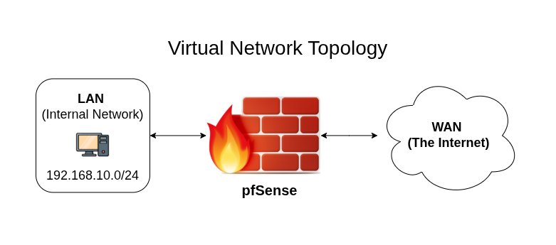
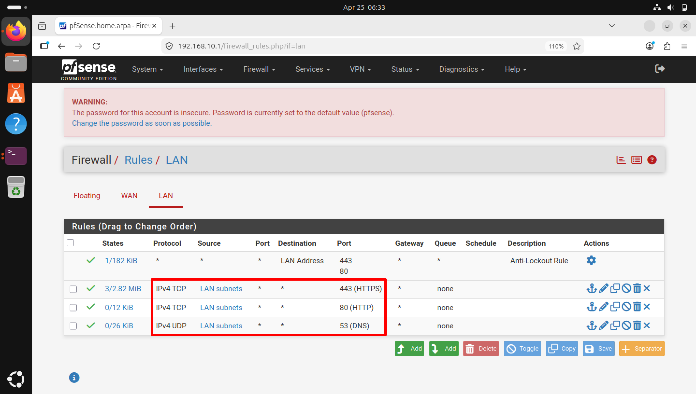
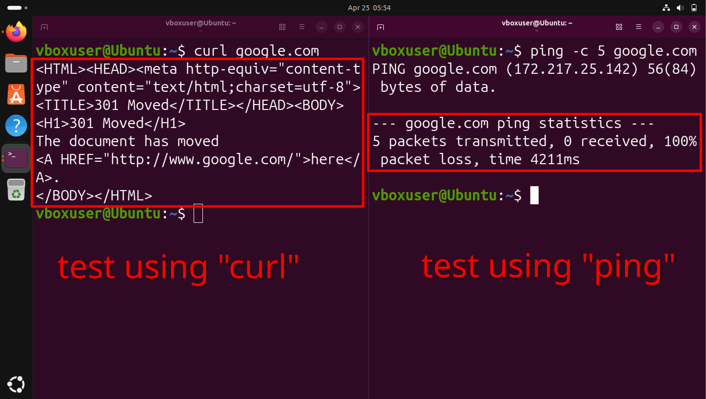

# Cybersecurity Homelab
Welcome to my cybersecurity homelab. This repository documents my hands-on experience building, configuring, and securing a virtualized network environment to practice enterprise-grade security principles.

## Objective
To architect a segmented virtual network and deploy a pfSense edge firewall. Instead of relying on the default configuration, I implemented strict egress filtering, utilizing a default-deny posture to only allow explicitly authorized traffic out of the LAN.

## Network Topology
The environment is divided into an isolated internal LAN and a WAN bridging to the internet, managed by the pfSense firewall. 

## Egress Filtering (Zero Trust Posture)
Out-of-the-box, pfSense contains a "Default Allow All" rule for the LAN. In a corporate environment, this is a major security risk. I disabled this default rule to enforce a **Default Deny** posture. 

I then created explicit "Allow" rules strictly for essential operational traffic:
* **Port 53 (UDP):** DNS Resolution
* **Port 80 (TCP):** HTTP Web Traffic
* **Port 443 (TCP):** HTTPS Secure Web Traffic

## Validation & Testing
To verify the firewall rules are functioning correctly, I tested outbound connectivity from the Ubuntu LAN client. 

As shown below:
1. **HTTP/HTTPS Traffic (Allowed):** Using `curl google.com` successfully resolves and reaches the target.
2. **ICMP Traffic (Blocked):** Using `ping google.com` results in 100% packet loss, successfully proving that unauthorized protocols are inherently dropped by the firewall.

